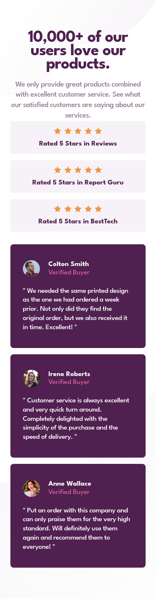
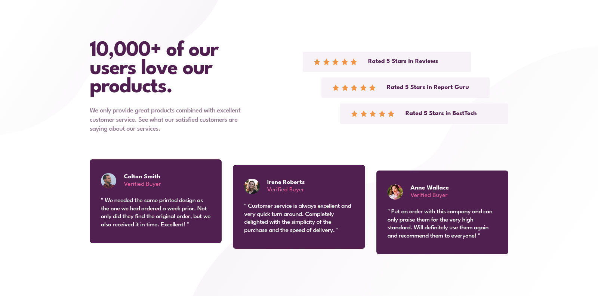

# Frontend Mentor - Social proof section solution

This is a solution to the [Social proof section challenge on Frontend Mentor](https://www.frontendmentor.io/challenges/social-proof-section-6e0qTv_bA). Frontend Mentor challenges help you improve your coding skills by building realistic projects.

## Table of contents

- [Overview](#overview)
  - [The challenge](#the-challenge)
  - [Screenshot](#screenshot)
  - [Links](#links)
- [My process](#my-process)
  - [Built with](#built-with)
- [Author](#author)

## Overview

### The challenge

Users should be able to:

- View the optimal layout for the section depending on their device's screen size

### Screenshot

#### Mobile View

#### Desktop View

The above screenshots show how the website looks on both mobile and desktop screens. The design is responsive and adjusts to different screen sizes using the mobile-first approach and flexbox layout. The use of colors, typography, and layout elements is consistent throughout the website, giving it a professional and cohesive look.

### Links

- Solution URL: [Frontend Mentor](https://www.frontendmentor.io/solutions/social-proof-section-using-flexbox-sass-and-bem-3N2uhX40FG)
- Live Site URL: [Netlify](https://bk-social-proof-section.netlify.app/)

## My process

### Built with

- Semantic HTML5 markup
- CSS custom properties
- Flexbox
- SASS
- BEM
- Mobile-first workflow

## Author

- Github - [BK Pecho](https://www.github.com/bkpecho)
- Frontend Mentor - [@bkpecho](https://www.frontendmentor.io/profile/bkpecho)
- Twitter - [@bkpecho](https://www.twitter.com/bkpecho)
